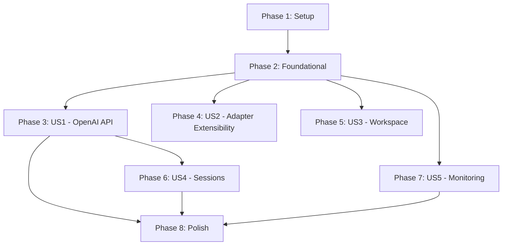

# Tasks: Agent Runtime Service

**Input**: Design documents from `/specs/001-agent-runtime-service/`

**Prerequisites**: plan.md (required), spec.md (required for user stories), research.md, data-model.md, contracts/

**Tests**: Tests are included per constitution (Testing Standards principle is Non-Negotiable).

**Organization**: Tasks are grouped by user story to enable independent implementation and testing of each story.

## Format: `[ID] [P?] [Story] Description`

- **[P]**: Can run in parallel (different files, no dependencies)
- **[Story]**: Which user story this task belongs to (e.g., US1, US2, US3)
- Include exact file paths in descriptions

## Phase 1: Setup (Shared Infrastructure)

**Purpose**: Project initialization, dependencies, and configuration

- [X] T001 Initialize Node.js project with package.json (type: module, engines: node >=22) in project root
- [X] T002 Install production dependencies (express, zod, pino, pino-http, tsyringe, reflect-metadata, prom-client, express-rate-limit, helmet, cors, compression, uuid) in project root
- [X] T003 Install dev dependencies (typescript, vitest, @types/express, @types/cors, @types/compression, @types/uuid, eslint, prettier, tsx, supertest, @types/supertest) in project root
- [X] T004 [P] Create tsconfig.json with strict mode, ESM, experimentalDecorators, emitDecoratorMetadata in project root
- [X] T005 [P] Create .eslintrc.cjs with TypeScript rules in project root
- [X] T006 [P] Create .prettierrc with formatting rules in project root
- [X] T007 [P] Create .env.example with all configuration variables in project root
- [X] T008 Create project directory structure matching plan.md layout (src/api/, src/agents/, src/sessions/, src/config/, src/telemetry/, src/types/, tests/unit/, tests/integration/, tests/e2e/, docker/)

---

## Phase 2: Foundational (Blocking Prerequisites)

**Purpose**: Core infrastructure that MUST be complete before ANY user story can be implemented

**⚠️ CRITICAL**: No user story work can begin until this phase is complete

- [X] T009 Implement environment config validation with Zod schema in src/config/config.ts
- [X] T010 [P] Define common TypeScript types (Message, ChatRequest, AgentResponse, AppError) in src/types/common.types.ts
- [X] T011 [P] Define OpenAI-specific types (ChatCompletionRequest, ChatCompletionResponse, ChatCompletionChunk, ModelsResponse) in src/types/openai.types.ts
- [X] T012 Implement Pino logger with JSON structured output and request-id support in src/telemetry/logger.ts
- [X] T013 [P] Implement Prometheus metrics (http_requests_total, http_request_duration_seconds, agent_executions_total, agent_execution_duration_seconds, agent_active_processes, sessions_active_total) in src/telemetry/metrics.ts
- [X] T014 Implement AppError class with typed error codes and HTTP status mapping in src/types/common.types.ts
- [X] T015 Implement request-id middleware (generates UUID, attaches to req/res) in src/api/middleware/request-id.middleware.ts
- [X] T016 [P] Implement auth middleware (Bearer token validation from config) in src/api/middleware/auth.middleware.ts
- [X] T017 [P] Implement error-handler middleware (catches AppError, formats OpenAI error response) in src/api/middleware/error-handler.middleware.ts
- [X] T018 [P] Implement rate-limit middleware (configurable window/max from config) in src/api/middleware/rate-limit.middleware.ts
- [X] T019 Implement AgentAdapter interface definition in src/agents/base/agent-adapter.interface.ts
- [X] T020 Implement ConcurrencyLimiter class (semaphore pattern with queue and timeout) in src/agents/base/concurrency-limiter.ts
- [X] T021 Implement AgentProcess utility (spawn wrapper with AbortController, timeout, stream support) in src/agents/base/agent-process.ts
- [X] T022 Implement AgentRegistry (register, get, list, listAvailable, validateAll) in src/agents/registry/agent-registry.ts
- [X] T023 Create DI container setup (register all services with tsyringe tokens) in src/container.ts
- [X] T024 Create Express app setup (middleware chain: request-id, pino-http, helmet, cors, compression, auth, rate-limit, routes, error-handler) in src/app.ts
- [X] T025 Create server entry point (reflect-metadata import, config load, agent validation, listen) in src/server.ts
- [X] T026 Write unit tests for config validation in tests/unit/config.test.ts
- [X] T027 [P] Write unit tests for ConcurrencyLimiter in tests/unit/agents/concurrency-limiter.test.ts
- [X] T028 [P] Write unit tests for AgentProcess in tests/unit/agents/agent-process.test.ts
- [X] T029 [P] Write unit tests for AgentRegistry in tests/unit/agents/agent-registry.test.ts
- [X] T030 [P] Write unit tests for auth middleware in tests/unit/middleware/auth.test.ts
- [X] T031 [P] Write unit tests for error-handler middleware in tests/unit/middleware/error-handler.test.ts

**Checkpoint**: Foundation ready — user story implementation can now begin in parallel

---

## Phase 3: User Story 1 — Connect OpenAI-compatible Client (Priority: P1) 🎯 MVP

**Goal**: Any OpenAI SDK client or LLM Gateway can call `/v1/models` and `/v1/chat/completions` (streaming + non-streaming) and receive valid responses.

- [X] T032 [US1] Implement Zod request validation schemas for POST /v1/chat/completions in src/api/validators/openai.schemas.ts
- [X] T033 [US1] Implement OpenAI response serializer (ChatCompletion, ChatCompletionChunk, ModelsListResponse) in src/api/serializers/openai.serializer.ts
- [X] T034 [US1] Implement Gemini CLI adapter (generate, streamGenerate, chat, streamChat, checkAvailability) in src/agents/gemini/gemini.adapter.ts
- [X] T035 [P] [US1] Implement Claude Code adapter (generate, streamGenerate, chat, streamChat, checkAvailability) in src/agents/claude/claude.adapter.ts
- [X] T036 [P] [US1] Implement Aider adapter (generate, streamGenerate, chat, streamChat, checkAvailability) in src/agents/aider/aider.adapter.ts
- [X] T037 [US1] Implement OpenAI controller (listModels, createChatCompletion with stream/non-stream branching) in src/api/controllers/openai.controller.ts
- [X] T038 [US1] Implement OpenAI routes (GET /v1/models, POST /v1/chat/completions) in src/api/routes/openai.routes.ts
- [X] T039 [US1] Wire OpenAI routes into Express app in src/app.ts
- [X] T040 [US1] Write unit tests for OpenAI validator schemas in tests/unit/validators/openai-schemas.test.ts
- [X] T041 [P] [US1] Write unit tests for OpenAI serializer in tests/unit/serializers/openai-serializer.test.ts
- [X] T042 [P] [US1] Write unit tests for Gemini adapter in tests/unit/agents/gemini-adapter.test.ts
- [X] T043 [P] [US1] Write unit tests for Claude adapter in tests/unit/agents/claude-adapter.test.ts
- [X] T044 [P] [US1] Write unit tests for Aider adapter in tests/unit/agents/aider-adapter.test.ts
- [X] T045 [US1] Write integration tests for GET /v1/models and POST /v1/chat/completions (non-streaming) in tests/integration/openai-api.test.ts
- [X] T046 [US1] Write integration tests for POST /v1/chat/completions (streaming SSE) in tests/integration/openai-api.test.ts
- [X] T047 [US1] Write E2E test using OpenAI Node.js SDK against running service in tests/e2e/openai-client.test.ts

**Checkpoint**: MVP complete — service can accept OpenAI-format requests and return valid responses via registered agents

---

## Phase 4: User Story 2 — Add New Agent Adapter (Priority: P2)

**Goal**: A developer can add a new agent by implementing AgentAdapter and registering it, with zero changes to routing/controllers.

- [X] T048 [US2] Create adapter development documentation with interface contract and example in docs/adding-adapters.md
- [X] T049 [US2] Create a mock/example adapter (EchoAdapter) demonstrating the interface in src/agents/echo/echo.adapter.ts
- [X] T050 [US2] Write integration test proving EchoAdapter is callable through /v1/chat/completions without route changes in tests/integration/adapter-extensibility.test.ts

**Checkpoint**: Extensibility proven — any new adapter works without touching API layer

---

## Phase 5: User Story 3 — Workspace-Scoped Agent Execution (Priority: P2)

**Goal**: Requests can specify a workspace directory; the agent process runs with that cwd. Unauthorized paths are rejected.

- [X] T051 [US3] Implement workspace validation utility (allowlist check, path traversal detection, path normalization) in src/utils/workspace-validator.ts
- [X] T052 [US3] Update OpenAI controller to extract workspace from request and pass to adapter in src/api/controllers/openai.controller.ts
- [X] T053 [US3] Update AgentProcess to accept and apply cwd option from workspace in src/agents/base/agent-process.ts
- [X] T054 [US3] Write unit tests for workspace validator (allowlist pass, allowlist reject, traversal rejection) in tests/unit/utils/workspace-validator.test.ts
- [X] T055 [US3] Write integration test for workspace-scoped request succeeding in tests/integration/openai-api.test.ts
- [X] T056 [US3] Write integration test for workspace rejection (forbidden path, path traversal) in tests/integration/openai-api.test.ts

**Checkpoint**: Workspace security validated — agents execute in authorized directories only

---

## Phase 6: User Story 4 — Session Persistence (Priority: P3)

**Goal**: Clients can create/retrieve/delete sessions for multi-turn conversations with context maintained.

- [X] T057 [US4] Implement SessionStore interface in src/sessions/session.interface.ts
- [X] T058 [US4] Implement MemorySessionStore (create, get, addMessage, delete, list with Map storage) in src/sessions/memory-session-store.ts
- [X] T059 [US4] Implement Zod validation schemas for session endpoints in src/api/validators/session.schemas.ts
- [X] T060 [US4] Implement session controller (create, get, delete) in src/api/controllers/session.controller.ts
- [X] T061 [US4] Implement session routes (POST /v1/sessions, GET /v1/sessions/:id, DELETE /v1/sessions/:id) in src/api/routes/session.routes.ts
- [X] T062 [US4] Wire session routes into Express app in src/app.ts
- [X] T063 [US4] Update OpenAI controller to load session context when session_id is provided in src/api/controllers/openai.controller.ts
- [X] T064 [US4] Update OpenAI controller to save assistant response to session after completion in src/api/controllers/openai.controller.ts
- [X] T065 [US4] Write unit tests for MemorySessionStore in tests/unit/sessions/memory-session-store.test.ts
- [X] T066 [US4] Write integration tests for session CRUD endpoints in tests/integration/session-api.test.ts
- [X] T067 [US4] Write integration test for multi-turn conversation via session_id in tests/integration/session-api.test.ts

**Checkpoint**: Sessions functional — multi-turn conversations maintain context

---

## Phase 7: User Story 5 — Production Monitoring (Priority: P3)

**Goal**: Health, readiness, and Prometheus metrics endpoints are operational for production observability.

- [X] T068 [US5] Implement health route (GET /health → {status: "ok"}) in src/api/routes/health.routes.ts
- [X] T069 [US5] Implement readiness route (GET /ready → agent availability check) in src/api/routes/health.routes.ts
- [X] T070 [US5] Implement metrics route (GET /metrics → prom-client register.metrics()) in src/api/routes/health.routes.ts
- [X] T071 [US5] Wire health routes into Express app (before auth middleware — no auth required) in src/app.ts
- [X] T072 [US5] Write integration tests for /health, /ready, /metrics endpoints in tests/integration/health-api.test.ts

**Checkpoint**: Observability ready — service is production-deployable

---

## Phase 8: Polish & Cross-Cutting Concerns

**Purpose**: Docker support, documentation, and final validation

- [X] T073 [P] Create multi-stage Dockerfile (build stage + slim runtime, non-root user) in docker/Dockerfile
- [X] T074 [P] Create docker-compose.yml (service definition, port mapping, env file) in docker/docker-compose.yml
- [X] T075 [P] Create vitest.config.ts with coverage configuration (80% threshold) in vitest.config.ts
- [X] T076 Add npm scripts (dev, build, start, test, test:unit, test:integration, test:e2e, lint, format) in package.json
- [X] T077 Create README.md with project overview, quickstart, API reference link, and architecture diagram in README.md

---

## Dependencies

**Critical path**: Phase 1 → Phase 2 → Phase 3 (MVP)

**Parallel opportunities after Phase 2**:
- Phase 4 (US2) can run in parallel with Phase 3
- Phase 5 (US3) can run in parallel with Phase 3
- Phase 7 (US5) can run in parallel with Phase 3

**Sequential dependencies**:
- Phase 6 (US4 Sessions) requires Phase 3 (needs OpenAI controller to integrate with)
- Phase 8 (Polish) requires Phase 3, 6, and 7

## Implementation Strategy

1. **MVP (Phase 1–3)**: Delivers a working service that accepts OpenAI-format requests and returns valid responses. This alone provides value to LLM Gateway and SDK users.
2. **Extensibility (Phase 4)**: Proves the adapter pattern works without code changes.
3. **Security (Phase 5)**: Adds workspace isolation for repository-aware operations.
4. **Multi-turn (Phase 6)**: Enables conversation persistence.
5. **Production (Phase 7–8)**: Adds monitoring, Docker, and documentation.
